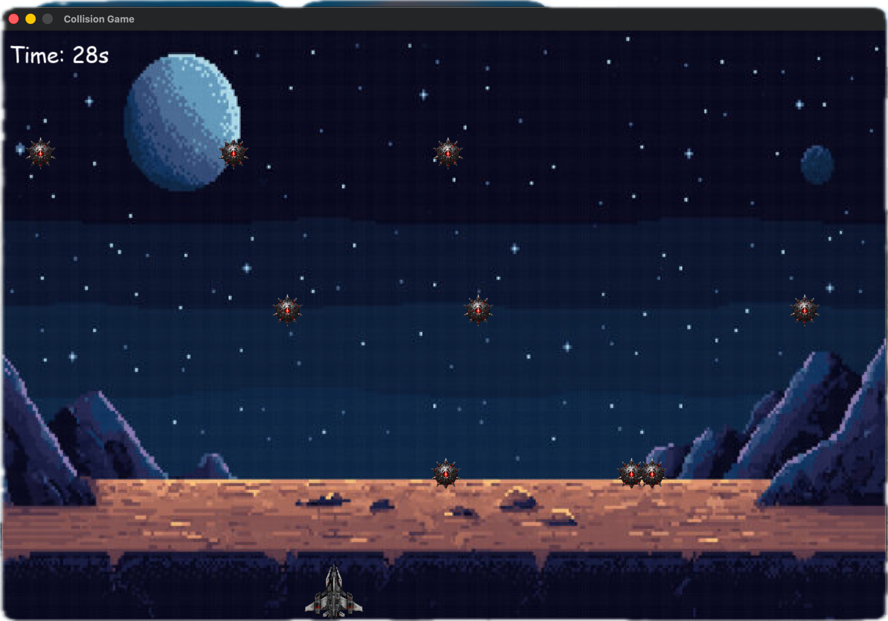

# Collision-Game-PyGame

This is a simple collision game made using PyGame. The player controls a spaceship and must avoid colliding with the falling stars for as long as possible. The game keeps track of the time survived, and the player can restart the game after a collision.

To run the game, make sure you have Python and PyGame installed. Then, simply run the `main.py` file. Use the left and right arrow keys to move the spaceship and avoid the stars. The game will display your survival time at the top left corner of the screen. Enjoy playing!

<!-- image of the game -->

